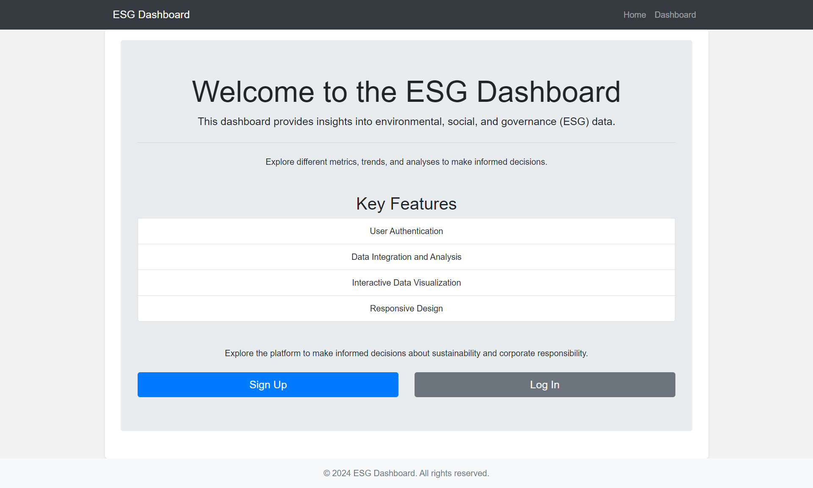
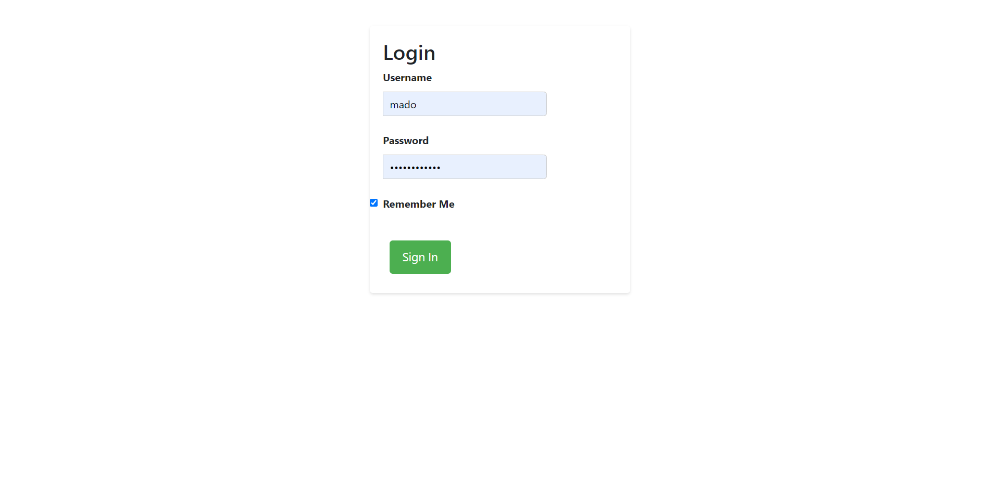
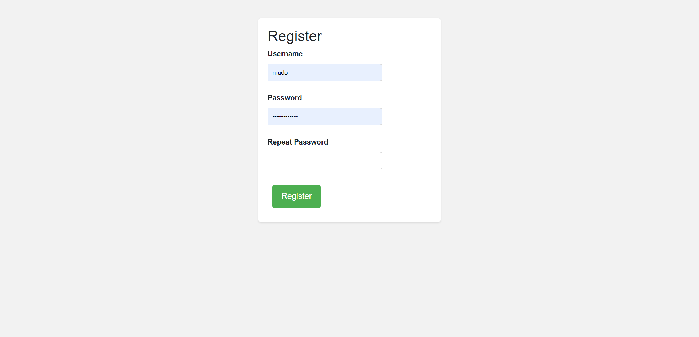
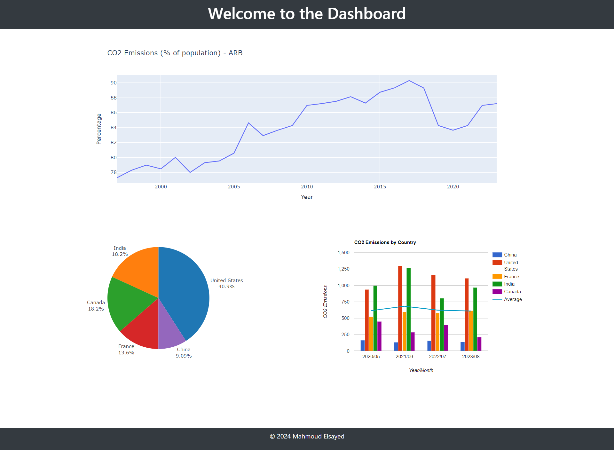

# ESG Analysis Platform

## 🧾 Table of Contents 

- [Introduction](#introduction)
- [Project_Structure](#Project_Structure)
- [KeyFeatures_V1](#KeyFeatures_V1)
- [Technologies_Utilized](#Technologies_Utilized)
- [Setup_Instructions](#Setup_Instructions)
- [Data_Visualization](#Data_Visualization)
- [Contributors](#Contributors)
- [License](#license)

## Introduction
Welcome to the ESG Analysis Platform, a sophisticated web-based tool designed for Environmental, Social, and Governance (ESG) analysis. The platform empowers users to explore ESG metrics, visualize data trends, and make informed decisions regarding sustainability and corporate responsibility.This project is your hint and simple start in ESG analysis.

## Project_Structure
```bash
├── app
│   ├── __init__.py
│   ├── __pycache__
│   │   ├── __init__.cpython-312.pyc
│   │   ├── dashboard.cpython-312.pyc
│   │   ├── forms.cpython-312.pyc
│   │   └── models.cpython-312.pyc
│   │   └── routes.cpython-312.pyc
│   │
│   ├── dashboard.py
│   ├── forms.py
│   ├── models.py
│   ├── routes.py
│   ├── static
│   │   ├── css
│   │   │   ├── dashboard.css
│   │   │   └── style.css
│   │   └── js
│   │       ├── dashboard.js
│   │       └── script.js
│   └── templates
│       ├── base.html
│       ├── dashboard.html
│       ├── index.html
│       ├── login.html
│       └── register.html
├── instance
│   ├── app.db
│   └── config.py
├── migrations
│   ├── alembic.ini
│   ├── env.py
│   ├── README
│   ├── script.py.mako
│   └── versions
│       └── 20962569eb8a_initial_migration.py
├── venv
├── app.db
├── LICENSE
├── README.md
└── requirements.txt
```

## KeyFeatures_V1
- **User Authentication**: Registration and login functionalities .
- **Data Integration**: Seamless integration with various ESG data sources for comprehensive analysis.
- **ESG Assessment**: Advanced algorithms evaluate ESG factors to provide valuable insights.
- **Data Visualization**: Interactive charts and graphs visually represent ESG data, aiding comprehension.
- **Responsive Design**: Support for diverse devices and screen sizes ensures accessibility and user-friendliness.

## Technologies_Utilized
- **Python**: Backend development powered by the Python programming language.
- **Flask**: Utilizes the Flask micro web framework for rapid web application development.
- **SQLAlchemy**: Interacts with databases using SQLAlchemy's SQL toolkit and ORM library.
- **Jinja2**: Templating engine renders HTML templates seamlessly within Flask.
- **HTML/CSS**: Frontend markup and styling languages for an intuitive user interface.
- **Bootstrap**: A powerful CSS framework used to ensure the platform's design is responsive and visually appealing across diverse devices and screen sizes.
- **JavaScript**: Enhances frontend interactivity and user experience.
- **Plotly**: Leverages the Plotly Python graphing library for creating dynamic visualizations.
- **Dash**: Harnesses the capabilities of Dash, a Python framework for building analytical web applications.

## Setup_Instructions
1. **Clone the Repository**: Download the repository to your local machine.
2. **Create Virtual Environment**: Set up a virtual environment and activate it.
3. **Install Dependencies**: Run  
```bash 
pip install -r requirements.txt
```  
to install necessary packages.

4. **Configure Environment Variables**: Customize environment variables and database settings according to your requirements.
5. **Run the Application**: Execute 
```bash
flask run
```
to launch the ESG Analysis Platform with no problems.

## Data_Visualization






## Contributors

- [Mahmoud Eid](https://github.com/Mado007/)
- [Mahmoud Elsayed](https://www.linkedin.com/in/mahmoud-elsayed/)

## License
This project is licensed under the [MIT License](LICENSE). Feel free to explore, modify, and distribute the codebase.
For any questions or feedback, please contact us at [Mahmoud Eid](mailto:eng.mahmod.eid.elsayed@gmail.com). Thank you for using the ESG Analysis Platform!

## 💰You can support me to make impact by Donating 
### OR a good message from you motivate me That i prefer this ♥
  [](https://buymeacoffee.com/Mahmoud.Madoo)
  [](https://paypal.me/mado999)

